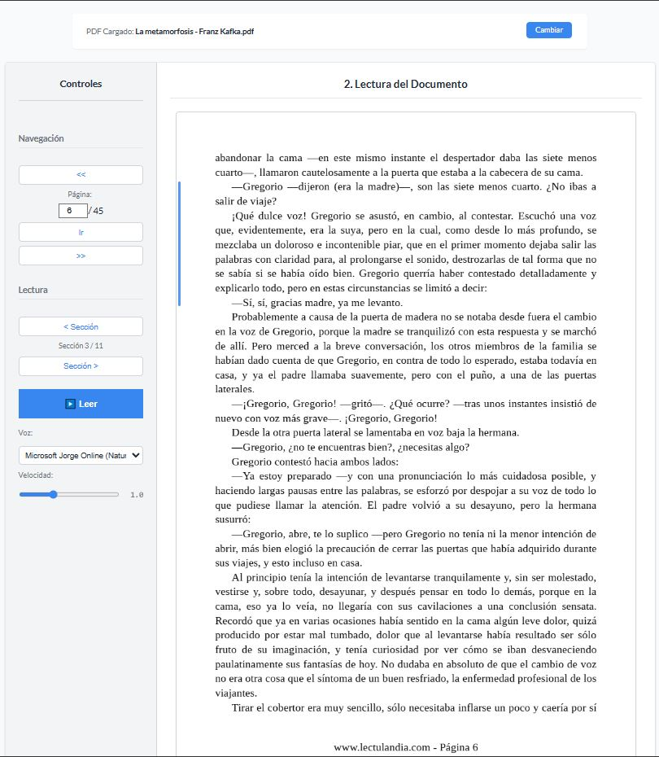

# Lector PDF a Voz: Tu Audiobook Personal (PDF-to-Speech Reader)

*Transforma tus documento PDF, especialmente libros, en una experiencia auditiva personalizada y gratuita.*

## Descripcion

¿Pasas tiempo programando, o trabajando o realizando tareas mientras escuchas podcasts o música, pero te gustaria aprovechar ese tiempo para "leer" libros o documentos importantes? ¿Te has topado con la limitada y a menudo costosa ofertade audiolibros en español?

Este proyecto nació precisamente de esa necesidad. Como Ingeniero de IA, buscaba una forma comoda y gratuita de consumir contenido PDF en formato audio. Tras encontrar que las soluciones existentes eran insuficientes o problematicas, decidi construir mi propia herramienta: un lector PDF a voz personalizable, simple y efectivo.

Esta aplicacion web te permite cargar cualquier archivo PDF y escucharlo utilizando las voces Text-to-Speech (TTS) integradas en tu propio navegador, de forma totalmente gratuita.

## Motivacion personal

Mi principal motivacion fue doble:

1.-     **Resolver una Necesidad Propia:** Queria una alternativa a los podcasts y la musica para mis largas sesiones frente al ordenador, permitiendome "leer" libros y documentos sin interrumpir mi flujo de trabajo. La frustracion con las opciones existentes (pocas, de pago, o poco usables como el lector de MS Edge) me impulso a crear algo a mi medida.
2.-     **Aprender y Crecer:** Como profesional del campo de la IA, este proyecto presento una valiosa oportunidad para salir de mi zona de confort, adentrarme en el mundo del desarrollo web (HTML, CSS y JavaScript) y familiarizarme con APIs del navegador como PDF.js y la Web Speech API. Es tambien una pieza que demuestra iniciativa, capacidad de autoaprendizaje y habilidad para construir soluciones practicas.

## ✨ Caracteristicas Principales.

*   ✅ **Conversion a "Audiobook":** Escucha tus PDFs (libros, artículos, documentos) mientras realizas otras actividades. ¡Una gran alternativa a repetir los mismos podcasts o canciones!
*   ✅ **Selección de Voz Gratuita:** Elige entre la variedad de voces TTS disponibles en tu sistema operativo/navegador *sin ningun costo*. ¡Utilizamos las voces que ya tienes, a diferencia de plataformas que cobran por ellas!
*   ✅ **Carga y Cambio Fácil de PDF:** Sube tu archivo PDF rápidamente y cámbialo por otro en cualquier momento.
*   ✅ **Navegacion Flexible:** Muevete entre paginas y entre secciones logicas de texto dentro de cada pagina.
*   ✅ **Indicador Visual Sincronizado:** Una barra lateral resalta la seccion de texto que se está leyendo en tiempo real, facilitando el seguimiento.
*   ✅ **Control de Velocidad:** Ajusta la velocidad de lectura para adaptarla a tu ritmo de escucha preferido.

## 🚀 Pruebalo en Vivo

¡Puedes probar la aplicacion directamente en tu navegador!

**[➡️ Acceder a la Demo en Vivo]**(https://leosiel.github.io/pdf-to-speech-reader/)

## 📸 Capturas de pantalla



## 🛠 Tecnologias Utilizadas

*   HTML5
*   CSS (con [Google Fonst - Lato](https://fonts.google.com/specimen/Lato))
*   JavaScript Moderno (M+odulos ES6+)
*   [PDF.js](https://mozilla.github.io/pdf.js/) (V3.4.120) - Utilizada para renderizar los archivos PDF en el navegador y extraer su contenido textual de forma estructurada.
*   [Web Speech API (SpeechSynthesis)](https://developer.mozilla.org/en-US/docs/Web/API/Web_Speech_API) - La API nativa del navegador que permite la funcionalidad Text-to-Speech.

## ⚙️ Cómo Ejecutar Localmente

Si deseas ejecutar el proyecto en tu máquina local:

1.  **Clona o descarga el repositorio:**
    ```bash
    git clone [https://github.com/Leosiel/pdf-to-speech-reader.git]
    cd pdf-to-speech-reader
    ```

2.  **Opción 1: Servidor Local (Recomendado)**
    Debido a que el proyecto utiliza Módulos JavaScript (`type="module"`), la forma más fiable de ejecutarlo es a través de un servidor local simple para evitar problemas de CORS o carga de módulos.
    *   Si tienes [Node.js](https://nodejs.org/) instalado, puedes usar `live-server`:
        ```bash
        # Instalar live-server globalmente (si no lo tienes)
        npm install -g live-server
        # Ejecutar el servidor en la carpeta del proyecto
        live-server
        ```
    *   Si usas VS Code, la extensión "Live Server" de Ritwick Dey es una excelente alternativa (probablemente la que ya usas). Simplemente haz clic derecho en `index.html` y selecciona "Open with Live Server".

3.  **Opción 2: Abrir Directamente (Puede no funcionar)**
    Puedes intentar abrir el archivo `index.html` directamente en tu navegador. Sin embargo, ten en cuenta que algunos navegadores pueden bloquear la carga de módulos JavaScript desde el sistema de archivos local (`file://`). Si la página aparece en blanco o con errores en la consola, utiliza la Opción 1.

## 🤔 Desafíos y Aprendizajes

*   **El Reto Más Complejo:** Sin duda, fue **sincronizar el audio TTS con el resaltador visual** del texto corresponiente. Lograr que el indicador lateral ('highlight-indicator-bar') se posicionara y redimensionara correctamente *en tiempo real* mientras la voz avanzaba fue un desafio considerable. Depende de obtener las coordenadas precisas de los elementes de texto extraidos por PDF.js, gestionar los tiempos de la API Web Speech y manejar la naturaleza asíncrona de todo el proceso.
*   **Aprendizajes Valiosos:**
    *   Profundice en la manipulacion del DOM y la intereaccion con APIs complejas del navegador (PDF.js, Web Speech).
    *   Gané experiencia práctica en el manejo de la asincronicidad en JavaScript (Promises, async/await).
    *   Me enfrenté a problemas reales de layout y posicionamiento con CSS.
    *   Comprendí mejor cómo integrar diferentes tecnologías frontend para construir una aplicacion funcional.
    *   Pude aplicar mi mentalidad de resolucion de problemas (Propio de la IA) a un domino diferente como es el desarrollo web.

    ## 🔮 Ideas Futuras

    Aunque el proyecto cumple su objetivo principal, hay algunas mejoras que me gustaría explorar en el futuro:

    *   Implementar un **tema oscuro** para una lectura más cómoda en condiciones de poca luz.
    *   **Refinar la interfaz de usuario (UI/UX)**, quizas reorganizando los botones o mejorando la estetica general.
    *   **¡Integrar IA!** Investigar la posibilidad de usar un modelo de **Inteligencia Artificial que se ejecute localmente** (ej. vía ONNX.js, TensorFlow.js) para generar voces TTS mucho más naturales y menos genéricas que las estandar del navegador, Esto conectaria directamente con mi campo de experiencia principal.

    ---
    *Este proyecto fue desarrollado como una herramienta personal y una oportunidad de aprendizaje en tecnologías web.*
